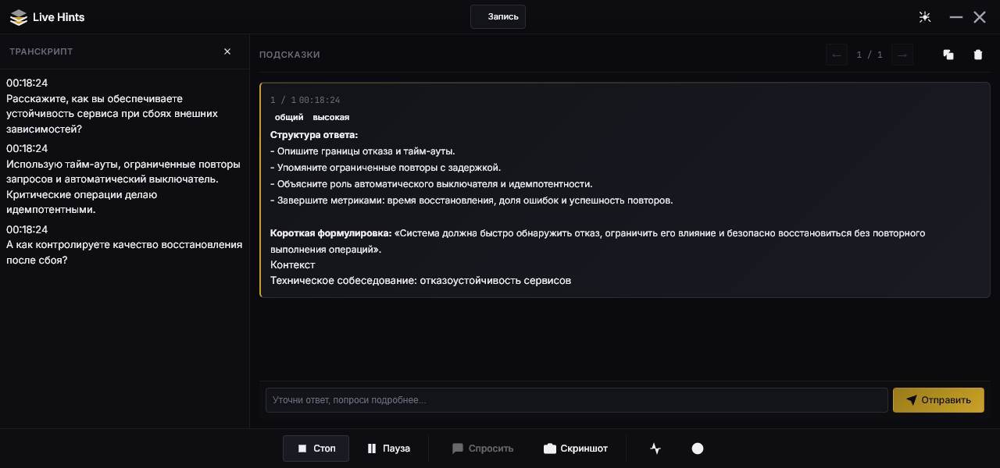
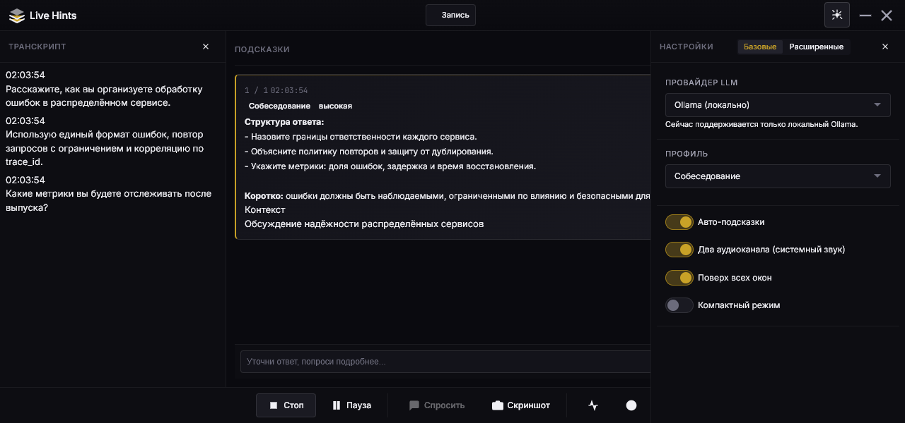
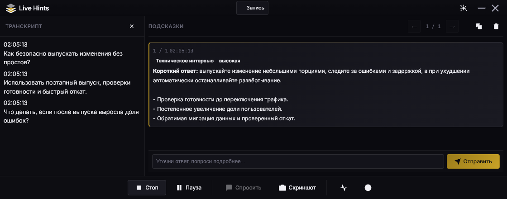

# Live Hints

Локальное Windows-приложение поверх других окон: оно распознаёт русскую речь из системного звука созвона и показывает краткие подсказки через Ollama.

[](https://github.com/R0D10Nq/live-hints/actions/workflows/ci.yml)
[](https://github.com/R0D10Nq/live-hints/releases/latest)
[](LICENSE)
[](#требования)
[](https://github.com/R0D10Nq/live-hints)

## Как выглядит

Основной поток: слева идёт локальная транскрипция, справа появляются подсказки с учётом контекста разговора.



<table>
  <tr>
    <td width="50%">
      
    </td>
    <td width="50%">
      
    </td>
  </tr>
  <tr>
    <td align="center">Настройки Ollama, профиля и поведения окна</td>
    <td align="center">Компактный режим поверх рабочего приложения</td>
  </tr>
</table>

Если такой сценарий вам полезен, поставьте звезду репозиторию. Это помогает оценить реальный интерес и выбрать следующие доработки.

## Скачать

Готовые файлы находятся на странице [последнего выпуска](https://github.com/R0D10Nq/live-hints/releases/latest):

- установщик `Live.Hints.Setup...exe`;
- portable-файл `LiveHints-Portable-...exe`;
- файл SHA-256 для проверки загрузки.

Важно: слово portable означает, что приложение не требует установки Electron. Для распознавания и генерации всё равно нужны системный Python с зависимостями, совместимая NVIDIA GPU и Ollama. Полностью автономной сборки без внешних компонентов пока нет.

Текущие файлы выпуска не подписаны коммерческим сертификатом разработчика, поэтому Windows SmartScreen может показать предупреждение. Сверьте SHA-256 с опубликованным файлом контрольных сумм перед запуском.

При обновлении с `v1.0.0` обязательно обновите выделенное Python-окружение и удалите из него ChromaDB по [инструкции выпуска v1.0.1](docs/releases/v1.0.1.md#обновление-с-v100).

## Что делает приложение

- захватывает системный звук через WASAPI loopback;
- при необходимости добавляет второй канал с микрофона;
- переводит русскую речь в текст через локальный `faster-whisper`;
- отправляет контекст в локальный Ollama и показывает потоковый ответ;
- держит подсказки поверх видеозвонка или редактора кода;
- сохраняет историю сессий локально;
- умеет анализировать скриншот через Ollama Vision при наличии модели LLaVA.

Обработка аудио, транскриптов и запросов к модели выполняется на `localhost` после установки зависимостей. Во время установки скачиваются Python-пакеты, CUDA-компоненты, модели и шрифты, поэтому проект нельзя называть полностью автономным или офлайн-приложением.

## Рабочий путь сейчас

Поддерживаемый серверный путь один: **Ollama** с локальной моделью, по умолчанию `qwen3:8b`. Модели можно менять из списка, который возвращает Ollama.

В коде проекта есть заготовки для других провайдеров и пользовательских инструкций, но активный сервер их пока не маршрутизирует. Они не заявляются как готовые функции и вынесены в планы.

Готовые профили подсказок:

- собеседование;
- переговоры;
- ежедневные созвоны;
- презентация.

## Требования

- Windows 10 или Windows 11;
- Python 3.11 или новее;
- Node.js 18 или новее;
- NVIDIA GPU с рабочей поддержкой CUDA и `float16` для текущего STT-пути;
- [Ollama](https://ollama.com/) и хотя бы одна текстовая модель;
- для анализа скриншотов дополнительно модель Vision, например `llava:7b`.

Текущий транскрайбер работает в режиме `cuda` и распознаёт русский язык. Автоматического CPU-запасного пути нет.

## Быстрый старт из исходников

Откройте PowerShell в каталоге проекта:

```powershell
npm install
npm run python:install
ollama pull qwen3:8b
npm start
```

После запуска нажмите **Старт** в окне приложения. Electron поднимет локальные STT- и LLM-сервисы, после чего можно начать разговор в созвоне.

Если серверы нужно запускать вручную для диагностики:

```powershell
.\venv\Scripts\python.exe python\stt_server.py
.\venv\Scripts\python.exe python\llm_server.py
```

Для Vision загрузите отдельную модель и используйте кнопку **Скриншот**:

```powershell
ollama pull llava:7b
```

## Сборка

```powershell
npm run build:installer
npm run build:portable
```

Артефакты появятся в `dist/`. Сборка включает исходники Python, но не виртуальное окружение, CUDA, Ollama и модели. Поэтому перед первым запуском на другом компьютере нужно выполнить требования из раздела выше.

## Возможности интерфейса

- окно поверх остальных приложений;
- прозрачность и компактный режим;
- пауза и повторное подключение к STT;
- автоматические подсказки после фразы;
- ручной запрос ответа по накопленному контексту;
- история сессий и экспорт данных;
- режим скрытия содержимого при демонстрации экрана;
- горячие клавиши для запуска, паузы, подсказки и показа окна.

## Производительность

Время ответа зависит от GPU, размера модели и длины контекста. В текущих локальных замерах проекта ориентиры такие:

| Этап                          | Ориентир                            |
| ----------------------------- | ----------------------------------- |
| STT на совместимой NVIDIA GPU | около 300 мс для готового фрагмента |
| Первый токен Ollama           | около 2–3 с                         |
| Полный ответ Ollama           | около 18–25 с                       |

Это ориентиры, а не SLA. Код допускает таймаут LLM до 120 секунд, поэтому обещание сквозной задержки 500 мс было бы неверным.

## Проверки

```powershell
npm test
npm run test:python
npm run test:e2e
```

Последний полный локальный прогон перед публичной упаковкой: **615 проверок** — 304 JavaScript, 281 Python и 30 E2E.

Дополнительные команды:

```powershell
npm run lint
npm audit --audit-level=high
```

## Приватность и безопасность

- IPC в `preload.js` ограничен явным списком каналов;
- загрузка PDF, DOCX, TXT и MD идёт через безопасный буферный обработчик с лимитом 10 МБ;
- локальные сервисы привязаны к `localhost`;
- пользовательский контекст и история хранятся в каталоге данных приложения и не входят в Git;
- чувствительные файлы (`user_context.txt`, `vacancy.txt`, `mode_context.txt`) исключены из отслеживания через `.gitignore`;
- для сообщения об уязвимости используйте [политику безопасности](SECURITY.md), а не публичную задачу.

## Ограничения и планы

Сейчас проект лучше всего подходит для Windows-компьютера с NVIDIA GPU и локальной моделью Ollama. В ближайшие задачи входят:

- полноценный маршрутизатор облачных провайдеров;
- применение пользовательских инструкций в активном потоке подсказок;
- CPU-режим или понятная проверка совместимости GPU;
- самодостаточная сборка с управлением зависимостями;
- дополнительные тесты запуска, сборки и восстановления после сбоя;
- улучшение читаемости интерфейса на небольших окнах.

## Как помочь

Перед изменением прочитайте [CONTRIBUTING.md](CONTRIBUTING.md). Для предложений используйте [форму новой возможности](https://github.com/R0D10Nq/live-hints/issues/new?template=feature_request.yml), для ошибок — [форму отчёта об ошибке](https://github.com/R0D10Nq/live-hints/issues/new?template=bug_report.yml).

Особенно полезны:

- проверка на разных моделях NVIDIA и версиях Windows;
- замеры задержки STT и Ollama на реальных созвонах без личных данных;
- предложения по интеграциям, которые можно выполнить локально;
- небольшие исправления документации и тестов.

## Лицензия

Проект распространяется по лицензии [MIT](LICENSE).
